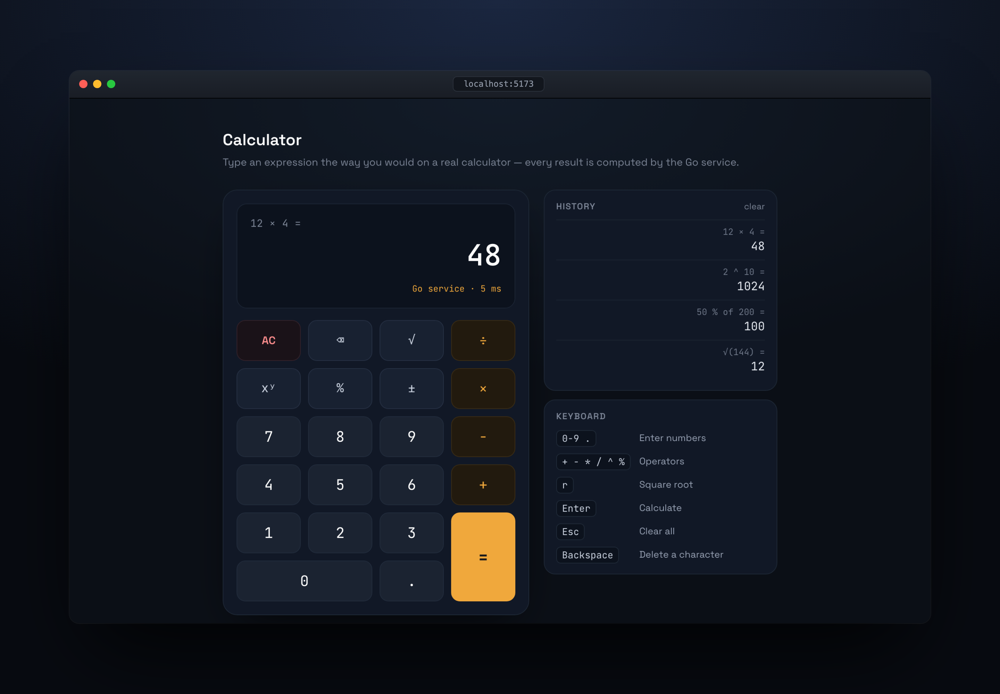

# Calculator

[](https://github.com/Manhud/calculator-fullstack/actions/workflows/ci.yml)

A calculator split across two services: a Go REST API that owns the arithmetic, and a React +
TypeScript frontend that consumes it.



The interesting part is not the arithmetic. It is where the rules live, how a bad input is refused,
and what happens at the edges — division by zero, the square root of a negative, a result that
overflows past what a `float64` can hold.

## Design at a glance

**One endpoint, operation as data.** `POST /api/v1/calculations` takes `{"operation": "...",
"operands": [...]}` rather than exposing `/add`, `/divide` and a route per operation. One validation
path, one error envelope, and adding an operation touches a switch statement instead of a new route,
handler and test file.

**Errors are codes, not prose.** Every client fault returns a machine-readable code —
`DIVISION_BY_ZERO`, `NEGATIVE_SQRT`, `RESULT_OVERFLOW` and four others — alongside a human message.
The frontend branches on the code and never parses the message. A fault in the service itself is
`INTERNAL_ERROR` with a 500, kept distinct so a bug here is never reported as the caller's mistake.
Every error response uses that envelope, including the router's 404 and 405.

**The domain knows nothing about HTTP.** `internal/calculator` imports no transport, no JSON and no
framework, so the arithmetic is tested without starting a server. Dependencies point inward.

**Arithmetic is `float64`, deliberately.** It is idiomatic, dependency-free and adequate for a
calculator. It is *not* adequate for money: `0.1 + 0.2` is not `0.3`, and in a payments context this
would use exact decimal arithmetic or integer minor units instead. Results that come out `NaN` or
`±Inf` are rejected before encoding rather than serialised.

Full rationale, including the alternatives that were considered and rejected, is in
[docs/DESIGN.md](docs/DESIGN.md).

## Repository

```
backend/    Go service — pure domain in internal/calculator, HTTP adapter in internal/transport
frontend/   React + TypeScript — all network access confined to src/api
docs/       DESIGN.md (rationale) · PROMPTS.md (AI-usage log) · coverage/ (reports)
scripts/    coverage.sh — renders the report and fails the build below threshold
```

`CLAUDE.md` holds the conventions this repository is written against: the frozen API contract, the
dependency rule, and the definition of done. It is committed on purpose — the constraints were set
before the code, and it is the specification the review agents in `.claude/agents/` check against.

## Running it

**With Docker** — nothing to install but Docker itself:

```bash
docker compose up --build
```

Then open <http://localhost:5173>. The API is on <http://localhost:8080>.

**Without Docker** — Go 1.23+ and Node 22 (`.nvmrc` pins it; `nvm use` picks it up):

```bash
make dev        # API on :8080, frontend on :5173
```

## The API

One endpoint. The operation travels in the body, so adding one touches a switch statement rather than
a new route. Every response below was produced by running the command against the service, not written
from memory.

### `POST /api/v1/calculations`

```bash
curl -X POST http://localhost:8080/api/v1/calculations \
  -H 'Content-Type: application/json' \
  -d '{"operation": "divide", "operands": [10, 4]}'
```

```json
{ "operation": "divide", "operands": [10, 4], "result": 2.5 }
```

`operation` is one of `add`, `subtract`, `multiply`, `divide`, `power`, `sqrt`, `percentage`.
`operands` holds two numbers, except for `sqrt`, which takes one.

```bash
# sqrt takes a single operand
curl -X POST http://localhost:8080/api/v1/calculations \
  -H 'Content-Type: application/json' -d '{"operation": "sqrt", "operands": [9]}'
#> {"operation":"sqrt","operands":[9],"result":3}

# percentage is "a percent of b"
curl -X POST http://localhost:8080/api/v1/calculations \
  -H 'Content-Type: application/json' -d '{"operation": "percentage", "operands": [50, 200]}'
#> {"operation":"percentage","operands":[50,200],"result":100}

# float64, shown rather than hidden — see DESIGN.md on why this would be wrong for money
curl -X POST http://localhost:8080/api/v1/calculations \
  -H 'Content-Type: application/json' -d '{"operation": "add", "operands": [0.1, 0.2]}'
#> {"operation":"add","operands":[0.1,0.2],"result":0.30000000000000004}
```

### Errors

Every failure — including the router's — uses one envelope. The `code` is the contract and is safe to
branch on; the `message` is for a human reading a log, and its wording may change.

```bash
curl -X POST http://localhost:8080/api/v1/calculations \
  -H 'Content-Type: application/json' -d '{"operation": "divide", "operands": [10, 0]}'
```

```json
{ "error": { "code": "DIVISION_BY_ZERO", "message": "cannot divide by zero" } }
```

The complete set, each with the request that provokes it and the response it returns:

| Request                                       | Status | Code                 | Message                                          |
| --------------------------------------------- | ------ | -------------------- | ------------------------------------------------ |
| `{"operation":`                                | 400    | `INVALID_JSON`       | request body is empty or incomplete              |
| `{"operation":"modulo","operands":[7,3]}`      | 400    | `UNKNOWN_OPERATION`  | operation must be one of add, divide, multiply, … |
| `{"operation":"sqrt","operands":[9,2]}`        | 400    | `INVALID_ARITY`      | sqrt takes 1 operand, got 2                      |
| `{"operation":"add","operands":["x",1]}`       | 400    | `INVALID_OPERAND`    | operands must be an array of finite numbers      |
| `{"operation":"add","operands":[1e400,1]}`     | 400    | `INVALID_OPERAND`    | operands must be an array of finite numbers      |
| `{"operation":"divide","operands":[10,0]}`     | 400    | `DIVISION_BY_ZERO`   | cannot divide by zero                            |
| `{"operation":"sqrt","operands":[-1]}`         | 400    | `NEGATIVE_SQRT`      | cannot take the square root of a negative number |
| `{"operation":"power","operands":[10,400]}`    | 400    | `RESULT_OVERFLOW`    | the result is too large to represent             |
| `POST /api/v1/nope`                            | 404    | `NOT_FOUND`          | no such endpoint                                 |
| `PUT /api/v1/calculations`                     | 405    | `METHOD_NOT_ALLOWED` | PUT is not allowed on this endpoint              |
| *a fault in the service*                       | 500    | `INTERNAL_ERROR`     | the request could not be processed               |

Two of those are worth a second look. `1e400` is valid JSON but outside `float64`, so it fails while
decoding rather than while calculating — a different code path from `NaN`, which is not JSON syntax at
all and comes back as `INVALID_JSON`. And `INTERNAL_ERROR` exists so a bug in the service is never
reported as the caller's mistake; every other code is a fault in the request.

### `GET /health`

```bash
curl http://localhost:8080/health
#> {"status":"ok"}
```

Used by the container healthcheck. Unversioned, because a health probe that breaks on an API version
bump is not a health probe.

## Commands

```bash
make help       # list every target
make test       # both test suites
make coverage   # regenerate docs/coverage/ and enforce the thresholds
make lint       # gofmt, go vet, oxlint, tsc --noEmit
make docker-up  # same as docker compose up --build
```

## AI usage

This was built with Claude Code. [docs/PROMPTS.md](docs/PROMPTS.md) records the prompts, what came
back, and — the part worth reading — where the output was corrected or rejected, and why.
